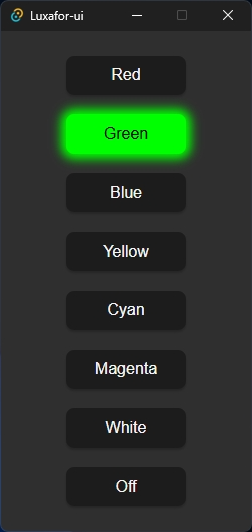

# Luxafor-ui

<p align="center">
    
</p>
<br clear="right"/>

# Getting started

## Installation
### Automatic installer (Debian/Ubuntu)

```bash
curl -fsSL https://nibrobb.dev/luxafor-ui.sh | sh
```

### Manual install
Go to [Releases](https://github.com/nibrobb/luxafor-ui/releases), expand 'Assets', then choose the distribution that is right for your system.
If you are on Mac, good luck.

## Slack integration
Control your busylight directly from Slack!

> [!NOTE]
> Luxafor-ui must be running when adding to slack since the local app stores the users access tokens

# Post-install 
Really only relevant for versions of Luxafor-ui < v0.1.0-alpha.2 and distros not supporting .deb or .rpm packages
See [POST-INSTALL.md](./POST-INSTALL.md)

## Build it yourself
Get your Tauri [prerequisites](https://tauri.app/start/prerequisites/) in order first

## Dependencies (Debian/Ubuntu or others)
Automatically install required packages
```bash
sudo apt install $(grep -vE "^\s*#" required-packages.apt | tr "\n" " ")
```

## NixOS
Use included `shell.nix` (will need tweaking)

Good luck.


## Common steps
Install the Tauri command line interface `tauri-cli`, the wasm-bundler `trunk` and the wasm32 target

Add the wasm32 build target
```bash
rustup target add wasm32-unknown-unknown
```

If on Apple Silicon (M1 or up), install `tauri-cli` and `trunk` from cargo directly.
```bash
cargo install --locked --version "^2.0" tauri-cli
cargo install --locked --no-default-features --features update_check,rustls trunk
```

Pro-tip: Consider using installing `tauri-cli` and `trunk` from [binstall](https://github.com/cargo-bins/cargo-binstall) (not suitable for Apple M1 and up)
```bash
cargo install cargo-binstall
cargo binstall tauri-cli@^2 trunk
```
## Build/bundle
Launch the app in development mode
```bash
cargo tauri dev
```

Build an executable without bundling
```bash
cargo tauri build --no-bundle
```

Build a .deb file for local installation
```bash
cargo tauri build --bundles deb
```

Build bundles and binaries for distribution depending no your system
```bash
cargo tauri build
```

## Recommended IDE Setup
[VS Code](https://code.visualstudio.com/) + [Tauri](https://marketplace.visualstudio.com/items?itemName=tauri-apps.tauri-vscode) + [rust-analyzer](https://marketplace.visualstudio.com/items?itemName=rust-lang.rust-analyzer)


### References
#### Setting up `trunk` to not use native Open SSL (which is a pain in the ass to set up)
- https://users.rust-lang.org/t/install-cargo-trunk-issue-with-x86-64-pc-windows-gnu-target/121119

#### Inspiration and udev rules borrowed from
- https://github.com/JnyJny/busylight

#### Luxafor library in rust
- https://crates.io/crates/luxafor

#### Binstall
- https://github.com/cargo-bins/cargo-binstall

#### Built with Tauri and Leptos, bundled with Trunk
- https://tauri.app/
- https://leptos.dev/
- https://trunkrs.dev/

